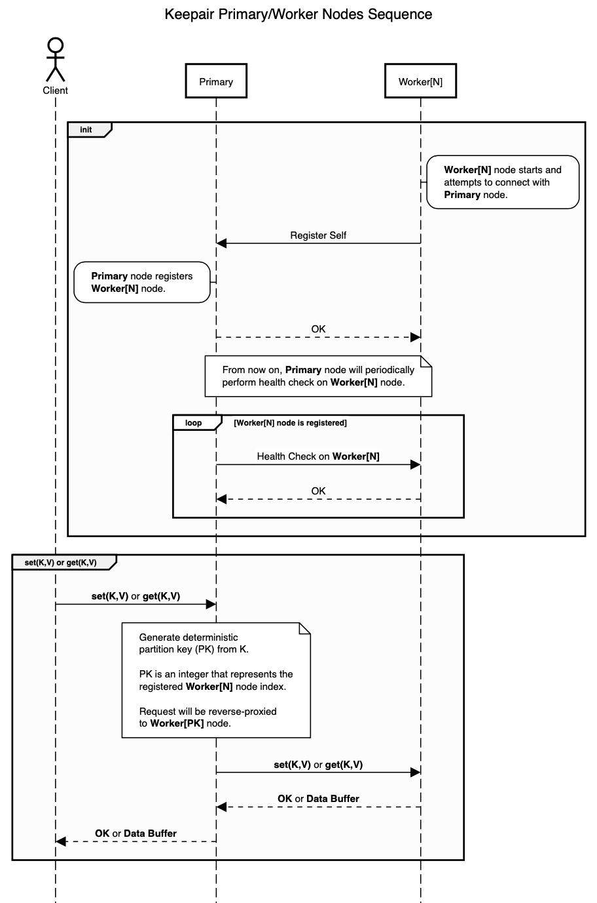

# Keepair

Yet another distributed key-value store.

Goals:
- Create a proof-of-concept for a distributed data store.
- Learn about the challenges of creating a distributed data store.
- Create a horizontally partitioned system with demonstrably better write performance than a single process. 

